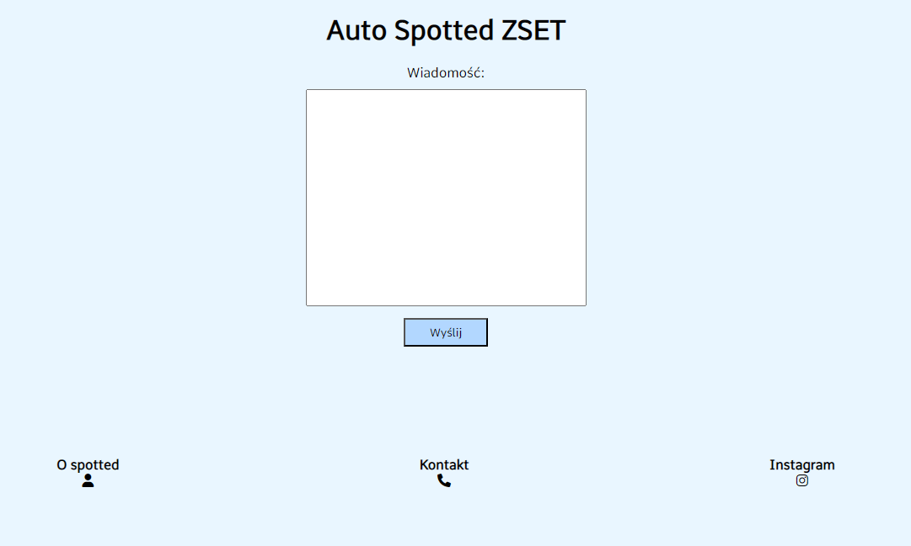
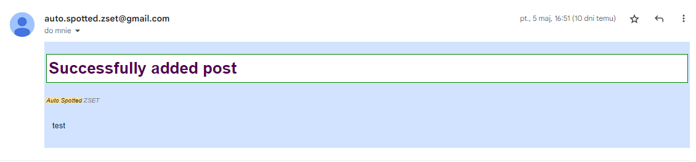
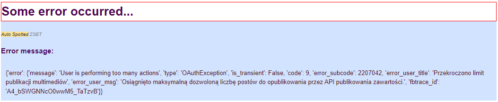

# Auto spotted

> Automatyczne spotted
>
> ### Spis treści
>
> * [Czym jest Auto spotted?](#about)
> * [Opis działania](#dzialanie)
> * [Zastosowane technologie](#technologie)
> * [Konfiguracja i uruchomienie](#konfiguracja)

## Czym jest Auto spotted?<a id="about"></a>

To nic innego jak zautomatyzowana wersja klasycznego spotted. Znacząco jednak różni się od 'normalnej' wersji - jest w
pełni automatyczne i działa asynchronicznie, do działania nie potrzebuje osoby, która robi screeny wpisów i wrzuca je na
Instagram.

## Opis działania<a id="dzialanie"></a>

Po kliknięciu znajdującego się na Instagramie linku do spotted (czy też adresu IP serwera, cięcie kosztów), otwiera nam
się strona internetowa aplikacji, która wygląda tak:



Po wpisaniu wiadomości i naciśnięciu przycisku ***wyślij***, pojawia się komunikat o tym, że wiadomość jest
przetwarzana. Po wyłączeniu komunikatu i odczekaniu kilku sekund, strona przekierowuje na Instagrama, gdzie już można
znaleźć wysłaną przez siebie wiadomość. W przypadku pojawienia się błędu, strona wyświetli komunikat o błędzie i jego
opisie.

Każda wysłana wiadomość na stronie trafia również na adres email administratora, dzięki czemu ma on od razu wgląd do
błędu, lub treści publikacji.

*Przykładowy email o pomyślnym dodaniu posta*



*Przykładowy email o błędzie podczas publikacji posta*



## Zastosowane technologie <a id="technologie"></a>

Aplikacja została postawiona na darmowym wirtualnym serwerze w usłudze Oracle Cloud, na którym zainstalowano **Apache2**
oraz **Python 3.10**.

Backend aplikacji działa na zasadzie *REST API*.

Po wpisaniu wiadomości na stronie i wciśnięciu przycisku, wykonuje się zapytanie (***fetch***) metodą *POST* na *
*backend**, który odbiera i przetwarza wysłaną wiadomość.

> ```javascript
> const response = await fetch(
>     "http://130.61.254.123:8000/",
>     {
>          method: "POST",
>          mode: "cors",
>          headers: {
>              "Access-Control-Request-Method": "POST",
>              "accept": "application/json",
>              "Access-Control-Request-Headers": ["Content-Type", "Authorization"],
>              "Content-Type": "application/json"
>          },
>          body: JSON.stringify({"message": dataToSend})
>      }
>      )
>      return response.json()
> ```
>
> *Fragment funkcji z pliku [index.html](pages/index.html)*


API stworzone jest przy użyciu webowego frameworka ***FastAPI*** w języku Python. Otrzymane od frontendu wiadomości są
na początku sprawdzane pod względem wulgaryzmów - jeżeli jakiś się pojawi, backend zwraca o tym informację do strony i
post się nie publikuje. Lista wulgaryzmów, które są sprawdzane, dostępna jest [tutaj](app/banned_words.txt).

> ```python
> with open("banned_words.txt", "r") as f:
>             for line in f.readlines():
>                 if line.strip() in body["message"]:
>                     return {
>                         "status_code": 451,
>                         "message": "Unavailable For Legal Reasons"
>                     }
> ```
>
> *Fragment funkcji z pliku [api.py](app/api.py)*


Następnym krokiem jest zamiana tekstu na zdjęcie, do którego wykorzystywany jest moduł Pillow oraz pilmoji, dzięki
którym możliwe jest wstawienie tekstu do zdjęcia z tłem.

> ```python
> img = Image.open(f"{os.getcwd()}/images/base.png")
> font = ImageFont.truetype(f"{os.getcwd()}/fonts/NotoSansNandinagari-Regular.ttf", 50, encoding='utf-8')
> draw_multiple_line_text(img, text, font, (255, 255, 255), 120)
> img.save(f"{os.getcwd()}/images/image{posts_count}.png")
> ```
>
> *Fragment funkcji z pliku [image.py](app/image.py)*


Gotowe zdjęcie jednak nie może zostać wysłane od razu na Instagrama - do publikacji potrzebny jest adres url do zdjęcia,
a nie sam plik. Dlatego też zdjęcia wysyłane są za pomocą zapytania POST do API serwisu Imgur, który umożliwia
przesyłanie zdjęć w formie bitów, zwracając link.

> ```python
> def upload_image(image):
>     url = "https://api.imgur.com/3/image"
>     headers = {
>         "Authorization": f"Client-ID {os.getenv('IMGUR_CLIENT_ID')}"
>     }
>     payload = {
>         "image": image
>     }
>     files = []
>     response = requests.request("POST", url, headers=headers, data=payload, files=files)
>     return response.json()['data']['link']
> ```
>
> *Fragment kodu z pliku [image.py](app/image.py)*


Otrzymany z powyższej funkcji adres url, przesyłany jest, również za pomocą zapytania POST, do API Instagrama, na którym
już przebiega końcowa część publikacji zdjęcia.

> *Funkcje z zapytaniami do API Instagrama dostępne w pliku [publish.py](app/publish.py)*

## Konfiguracja i uruchomienie <a id="konfiguracja"></a>

TODO: Finish this
